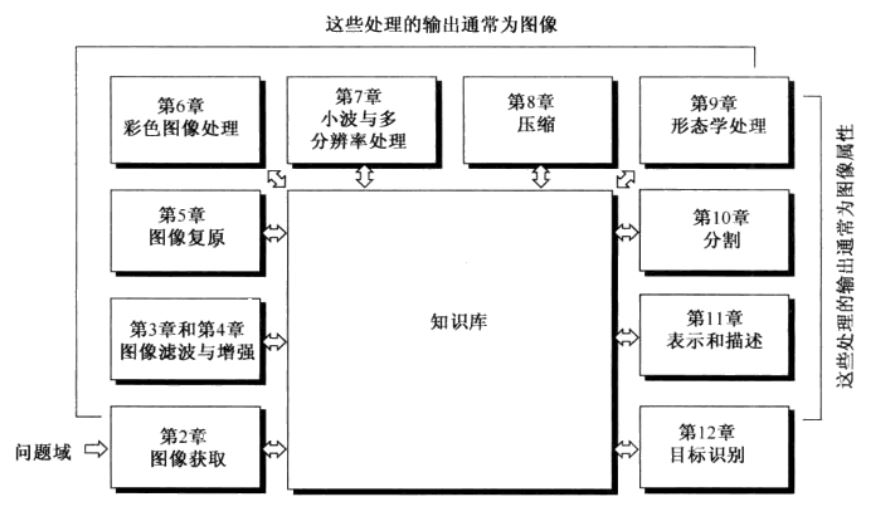

# 绪论
目录
+ [**绪论**](./第1章：绪论.md)
+ [数字图像基础](./第2章：数字图像基础.md)
+ [灰度变换与空间滤波](./第3章：灰度变换与空间滤波.md)
+ [频率域滤波](./第4章：频率域滤波.md)
+ [图像复原与重建](./第5章：图像复原与重建.md)
+ [彩色图像处理](./第6章：彩色图像处理.md) 
+ [小波和多分辨率处理](./第7章：小波和多分辨率处理.md) 
+ [图像压缩](./第8章：图像压缩.md) 
+ [形态学图像处理](./第9章：形态学图像处理.md) 
+ [图像分割](./第10章：图像分割.md) 
+ [表示和描述](./第11章：表示和描述.md) 
+ [目标识别](./第12章：目标识别.md) 

## 引言
本章主要的目的有:  
1. 定义图像处理领域的范围；
2. 从历史角度回顾图像处理的起源；
3. 给出图像处理技术状况的概念；
4. 简要讨论数字图像处理中所用的主要方法；
5. 概述通用目的的典型图像处理系统的组成；

## 什么是数字图像处理
数字图像处理为其输入和输出都是图像的处理，另外包含从图像中提取特征的处理，直至包括各个目标的识别。

## 数字图像处理的起源
...

## 使用数字图像处理领域的实例
+ 伽马射线成像
+ X射线成像
+ 紫外波段成像
+ 可见光及红外波段成像
+ 微波波段成像
+ 无线电波段成像
+ 其他成像方式的例子

## 数字图像处理的基本步骤

</img>
图1.1 数字图像处理的基本步骤

  

+ 图像获取：图像获取阶段包括图像预处理，譬如图像缩放
+ 图像增强：是对一幅图像进行某种操作，使其结果在特定应用中比原始图像更适合进行处理。