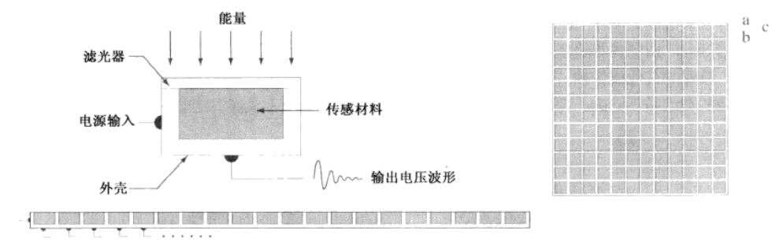

# 数字图像基础
目录
+ [绪论](./第1章：绪论.md)
+ [**数字图像基础**](./第2章：数字图像基础.md)
+ [灰度变换与空间滤波](./第3章：灰度变换与空间滤波.md)
+ [频率域滤波](./第4章：频率域滤波.md)
+ [图像复原与重建](./第5章：图像复原与重建.md)
+ [彩色图像处理](./第6章：彩色图像处理.md) 
+ [小波和多分辨率处理](./第7章：小波和多分辨率处理.md) 
+ [图像压缩](./第8章：图像压缩.md) 
+ [形态学图像处理](./第9章：形态学图像处理.md) 
+ [图像分割](./第10章：图像分割.md) 
+ [表示和描述](./第11章：表示和描述.md) 
+ [目标识别](./第12章：目标识别.md) 

## 引言
　　本章的主要目的的介绍本书所用到的数字图像处理的一些基本概念

## 光、电磁波谱的其他分量及它们的成像特点
　　电磁波谱可用波长、频率或能量来描述。波长(λ)和频率(v)的关系可用λ=c/v来描述，其中c是光速(2.998x108m/s),
电磁波谱的各个分量的能量由E=hv公式给出，其中h是普朗克常数。  
　　光是一种特殊的电磁辐射，可以为人眼感知，人感受一个物体的颜色由物体反射光的性质决定的。没有颜色的光称为单色光或无色光，
单色光唯一的属性是它的强度或大小。  
　　除了频率外，还有三个基本量用于描述彩色光源的质量：发光强度、光通量和亮度。发光强度是从光源流出能量的总量，通常用瓦特(W)来度量；
光通量是观察者从光源感受到的能量，用流明数(lm)来度量；亮度是光感知的主观描绘子，具体体现了强度的无色概念，是描述彩色感觉得参数之一。  
　　虽然成像主要以电磁波发射的能量为基础，但这并不是生成图像的唯一方法。  
## 图像感知和获取
　　通过将输入电能和对特殊类型检测能源敏感的传感器材料组合，把输入能源转变为电压。
输出电压波形是传感器的响应，通过把传感器响应数字化，从每一个传感器得到的一个数字量。如[图2.1](#图2.1)所示  

</img>
图2.1 图像感知的方式

  
　　一般而言，图像是通过以下方式来获取的：  

+ 使用单个传感器获取图像（如以前的胶片相机）
+ 使用条带传感器获取图像（如平板扫描仪，或医学成像）
+ 使用传感器阵列获取图像（如CCD阵列等）

## 图像取样和量化
　　一幅图像的x和y坐标及幅度可能都是连续的，为了将它转换为数字形式，必须在坐标上和幅度上都进行取样操作，
对坐标值进行数字化成为取样，对幅值数字化成为量化。量化所达到的精度很大程度上依赖于取样信号的噪声。  

## 图像内插
　　图像内插是在诸如放大、收缩、旋转和几何校正等任务中广泛应用的基本工具，这是基本的图像重采样方法。从根本上看，内插是用已知数据来估计未知位置的数值的处理。  
　　假设一幅图像大小为500X500像素，要放大到1.5倍到750X750像素，显然750X750网格的像素间隔要小于原图像的像素间隔。为了对覆盖的每一个点赋以灰度值，
可以在原图像中寻找最接近的像素，并把该像素的灰度赋给750X750网格中的新像素。这样的方法称之为最近邻内插法，这种方法简单，但实际上该方法会导致如某些直边缘的严重失真等人为缺陷，
因为这一原因，实际上该方法并不常用。  
　　更为实用的是双线性内插方法，该方法用4个最近邻去估计给定位置的灰度。令(x,y)为想要赋以灰度值的位置的坐标，并令v(x,y)表示灰度值，对于双线性内插来说，
赋值是由[(2-1)](#(2-1))公式得到的：  

(2-1)

　　其中，4个系数可由4个用(x,y)点最近邻点写出的未知方程确定。  
　　下一种复杂度较高的方法是双三次内插，它包括了16个最近邻点，其公式如[(2-2)](#(2-2))所示:  

(2-2)

  

　　双三次内插和双二次内插相比，其对图像细节的保留程度要好于双二次内插。在内插中，还有采用更多最近邻点和更复杂的技术，比如采用样条和小波技术，
这是因为对于三维图像重建和医学图像来说，保留更多的细节是其一个重要考虑因素。对于一般目的的图像处理来说，在综合考虑计算负担的合理性后，一般都会选择双二次内插或者双三次内插。  

## 像素之间的一些基本关系
### 相邻像素
　　位于坐标(x,y)处的像素p一般有4个水平和垂直的相邻像素，这些像素称为p的4邻域。除此之外，p还有4个对角相邻像素，与前面的相邻像素点一起构成p的8邻域。
### 邻接性、连通性、区域和边界
　　我们定义V为邻接性的灰度值集合，在二值图像中，把具有1值的像素归于邻接像素，则V = {1},并假定p像素的4邻域集合为N4(p)，p像素的8邻域集合为N8(p)，那么，我们将考虑三种类型的邻接：
+ 4邻接：即如果像素q在集合N4(p)中，则有V种数值的两个像素p和q是4邻接的。
+ 8邻接：即如果像素q在集合N8(p)中，则有V种数值的两个像素p和q是8邻接的。
+ 混合邻接：如果（i）q在N4(p)中，或(ii)q在ND(p)中，且集合N4(p)∩N4(q)中没有来自V中数值的像素，则具有V中数值的两个像素p和q是m邻接的。

### 距离度量
　　对于坐标分别为(x,y),(s,t)和(v,w)的像素p,q和z，如果：  
1. D(p,q)≥0【D(p,q)=0，当且仅当p=q】
2. D(p,q)=D(q,p)且
3. D(p,z)≤D(p,q) + D(q,z)  

　　则D是距离函数或度量。那么p和q间的欧氏距离如式[(2-3)](#(2-3))所示  

(2-3)

### 矩阵、算术及集合操作
其他一些操作均为矩阵算术操作，有兴趣的可以看线性代数和矩阵论，集合逻辑上操作可以看集合论。

### 空间操作
　　空间操作是直接作用于给定图像的像素上执行的，可以把空间操作分为三大类：
+ 单像素操作
+ 邻域操作
+ 几何空间变换

　　单像素操作可以用一个形如式[(2-4)](#(2-4))的变换函数T来描述

(2-4)

其中z是原图像中像素的灰度，s是处理后的图像中相应像素的映射灰度。

　　邻域操作，