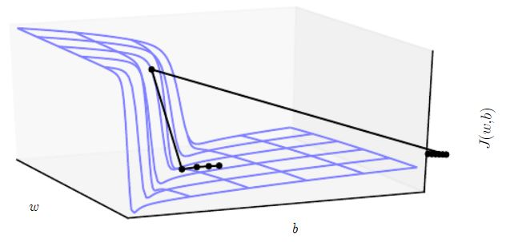
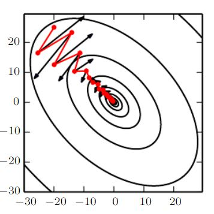

# 深度模型中的优化
### 目录  
+ [应用数学与数学基础](../应用数学与数学基础/ "../应用数学与数学基础/") 
    + [线性代数](../应用数学与数学基础/线性代数.md "../应用数学与数学基础/线性代数.md")
    + [概率与信息论](../应用数学与数学基础/概率与信息论.md "../应用数学与数学基础/概率与信息论.md") 
    + [数值计算](../应用数学与数学基础/数值计算.md "../应用数学与数学基础/数值计算.md")
    + [机器学习基础](../应用数学与数学基础/机器学习基础.md "../应用数学与数学基础/机器学习基础.md")
+ [深度网络:现代实践](../深度网络：现代实践/ "../深度网络：现代实践/")
    + [深度前馈网络](../深度网络：现代实践/深度前馈网络.md "../深度网络：现代实践/深度前馈网络.md")
    + [深度学习中的正则化](../深度网络：现代实践/深度学习中的正则化.md "../深度网络：现代实践/深度学习中的正则化.md")
    + [**深度模型中的优化**](../深度网络：现代实践/深度模型中的优化.md "../深度网络：现代实践/深度模型中的优化.md")
    + [卷积网络](../深度网络：现代实践/卷积网络.md "../深度网络：现代实践/卷积网络.md")
    + [序列建模:循环和递归网络](../深度网络：现代实践/序列建模：循环和递归网络.md "../深度网络：现代实践/序列建模：循环和递归网络.md")
    + [实践方法论](../深度网络：现代实践/实践方法论.md "../深度网络：现代实践/实践方法论.md")
    + [应用](../深度网络：现代实践/应用.md "../深度网络：现代实践/应用.md")
+ [深度学习研究](../深度学习研究/ "../深度学习研究/")
    + [线性因子模型](../深度学习研究/线性因子模型.md "../深度学习研究/线性因子模型.md")
    + [自编码器](../深度学习研究/自编码器.md "../深度学习研究/自编码器.md")
    + [表示学习](../深度学习研究/表示学习.md "../深度学习研究/表示学习.md")
    + [深度学习中的结构化概率模型](../深度学习研究/深度学习中的结构化概率模型.md "../深度学习研究/深度学习中的结构化概率模型.md")
    + [蒙特卡罗方法](../深度学习研究/蒙特卡罗方法.md "../深度学习研究/蒙特卡罗方法.md")
    + [直面配分函数](../深度学习研究/直面配分函数.md "../深度学习研究/直面配分函数.md")
    + [近似推断](../深度学习研究/近似推断.md "../深度学习研究/近似推断.md")
    + [深度生成模型](../深度学习研究/深度生成模型.md "../深度学习研究/深度生成模型.md")

## 前言
　　本文主要介绍神经网络训练中的优化技术，兵主要关注一类特定的优化问题：寻找神经网络上的一组参数θ，它能显著地降低代价函数J(θ)，
该代价函数通常包括整个训练集上的性能评估和额外的正则化项。  
　　本文首先会介绍机器学习任务中作为训练算法使用的优化与纯优化有哪些不同；其次，会介绍导致神经网络优化困难的几个具体挑战；然后，
会介绍几个使用算法，包括优化算法本身和初始化参数的策略，包括更高级的可以自适应调整学习率和使用二阶导数的信息的算法；最后，
将介绍几个简单优化算法结合成高级过程的优化策略。
## 深度模型训练的优化算法和传统优化算法的不同
　　在大多数的机器学习问题上，我们只关注某些性能度量P，P定义于测试集上并且可能是不可解的，这导致我们只能间接优化P。而纯优化是最小化目标J本身。
通常来讲，代价函数可写为训练集上的平均，更进一步的是希望最小化取自数据生成分布pdata的期望，其公式如下所示　　

(1-1)

### 经验风险最小化
　　机器算法的目标是降低[代价函数](#(1-1))的期望泛化误差，这样的误差我们称之为风险，而通常我们是无法知道pdata(x,y)的，
只能知道训练集中的样本。而将机器学习问题转化会一个优化问题的最简单方法是最小化训练集上的期望损失，这意味着我们必须用训练集上的经验分布

替代真实分布p(x,y)，进而最小化经验风险：  

(1-2)

  
但是经验风险最小化容易导致过拟合，此外，很多情况下，经验风险最小化并不一定可行的，比如对于0-1损失函数根据经验风险最小化是没有有效导数的。

### 代理损失函数和提前终止
　　正如上面所说的，有时候真正的损失函数并不能被高效优化，这种情况下，我们通常会去优化其代理损失函数，比如0-1损失函数，我们不能直接有效优化，
但是可以通过正确列别的负对数似然函数来代替0-1损失函数。在某些情况下，代理损失函数要比原损失函数学到的更多。一般的优化和用于训练算法的优化的
一个重要的不同是训练算法通常不会停止在局部极小点，但是在基于提前终止([深度学习中的正则化-提前终止](./深度学习中的正则化.md#提前终止))的收敛条件满足时停止。
与纯优化不同的是，提前终止时代理损失函数的仍然有较大的导数，而纯优化终止时导数较小。

### 批量算法和小批量算法
　　机器学习算法和一般优化算法不同的一点是，机器学习算法的目标函数通常可以分解为训练样本上的求和，因此，可以使用整个训练集的优化算法，
被称为批量或确定性的梯度算法，而每次使用单个样本的优化算法被称为随机或者在线算法，大多数的深度学习算法则是介于上述两者之间，
即使用一个以上而又不是全部的训练样本，称之为小批量或者小批量随机(常常简称为随机方法)，小批量的大小通常由以下几个因素决定的：  

+ 更大的批量会计算更精确的梯度估计，但是回报却是小于线性的。
+ 极小批量通常难以充分利用多核架构。这促使我们使用一些绝对最小批量，低于这个值的最小批量处理不会减少计算时间。
+ 如果批量处理中的所有样本可以并行处理，那么内存消耗和批量大小会正比。对于很多硬件设施，这是批量大小的限制因素。
+ 在某些硬件上使用特定大小的数组时，运行时间会更少。尤其是在使用GPU时，通常会使用2的幂数作为批量大小可以获得更少的运行时间。
+ 可能是由于小批量在学习过程中加入噪声，会有一些正则化效果[\[1\]](#footnote1)。  
  
　　不同的算法使用不同的方法从小批量中获取不同的信息；小批量是随机抽取的这点也很重要；很多机器学习上的优化问题都可以分解成并行地计算不同样本上单独的更新。  
　　小批量随机梯度下降一个有趣的现象是只要没有重复使用样本，那么它将遵循着真实泛化误差的梯度，即第一次遍历数据时，每个小批量样本计算出来的
真实泛化误差都是无偏估计，当重复使用后得到的真实泛化误差估计是有偏的。因为学习器每次看到的样本(x,y)都是来自数据生成分布pdata(x,y)，
这种情况意味着样本永远不会重复，获得的样本都是无偏样本。
## 神经网络优化中的挑战
　　优化是一个及其困难的任务，传统的机器学习都会精心设计目标函数和约束，以确保优化问题是凸的；然而，我们在训练神经网络时，都会碰到非凸问题，
即便是凸优化问题，也并非能够在优化上一帆风顺的。
### 病态
　　病态体现在随机梯度下降会卡在某些情况，这其中最突出的是Hessian矩阵H的病态。我们假定代价损失函数的近似二阶泰勒级数展开为：  

(1-3)

  
　　我们假设x = x(0) - εg，那么上述公式可转化为：  

(1-4)

  
　　所以，代价损失函数的二阶泰勒级数展开的预测梯度下降中的-εg会使得损失代价误差增加  

(1-5)

   
　　当1/2ε2gTHg超过εgTg时，
梯度的病态就会成为问题。因此，判断病态是否出现在神经网络训练任务中，可以通过检测平方梯度的范数gTg和gTHg来看，
尽管有如牛顿法可以解决病态的技术，但并不是适应神经网络的训练。

### 局部极小值
　　凸优化问题的一大突出特点是可以简化其为寻找一个局部极小点的问题，任何一个局部极小点都是全局最小点。但是对非凸函数如神经网络来说，可能会存在多个局部极小点，
因为模型可辨识性问题，神经网络和任意具有多个等效参数化潜变量的模型都会具有多个局部极小值，如果一个足够大的训练集可以唯一确定一组模型参数，
那该模型被称为可辨认的。导致神经网络不可辨认的原因是：
+ 权重空间对称性，这意味着通过相互狡猾潜变量我们是可以得到等价的模型的
+ 在任意整流线性网络或maxout网络中，将传入权重和偏置扩大a倍，再将传出的权重缩小a倍，这样也会保持模型等价

这些不可辨识性问题导致的局部极小值都有相同的代价函数值，如果局部极小值比全局最小点拥有很大的代价损失，那局部极小值会带来很大的隐患

### 高原、鞍点和其他平坦区域
　　在低维空间中，局部极小值很普遍；在更高维空间中，局部极小值很罕见，但鞍点则很常见，这种现象在直观上的理解是，Hessian矩阵在局部极小值点处只有正特征值，
而在鞍点处，Hessian矩阵则同时具有政府特征值。  
　　除了鞍点外，也可能存在恒值的、宽且平坦的区域，在这些区域中，梯度和Hsessian矩阵都是零。

### 悬崖和梯度爆炸
　　多层神经网络通常存在像悬崖一样的斜率较大区域，如下图1.1所示，像这样的悬崖结果，梯度在更新上会很大程度地改变参数值，不管是从上还是从下接近悬崖，
都会引起梯度的爆炸现象，幸运的是，可以通过梯度截断来避免这一严重后果。  

图1.1 梯度悬崖

## 基本算法
### 随机梯度下降
　　按照[批量算法和小批量算法](#批量算法和小批量算法)中讨论的内容，对数据生成分布抽取m个小批量(即独立同分布的)样本，通过计算它们的梯度均值，
得到梯度的无偏估计。其算法如下：
>算法 随机梯度下降(sgd)在第k个训练迭代的更新。  
>Require: 学习率εk  
>Require: 初始参数θ  
>　while 停止准则未满足 do  
>　　从训练集中采包含m个样本{x(1)，···，x(m)}的小批量，其中x(i)对应的目标为y(i)。  
>　　计算梯度估计:  
>　　应用更新:

　　SGD算法中的一个关键参数是学习率，保证SGD收敛的一个充分条件是：  

(1-6)

  
　　且  

(1-7)

  
　　在实践中，一般会显示衰减学习率知道第τ次迭代：  

  
其中，  

  
在τ次迭代后，一般使ε保持常数。通常来说ετ应设为大约ε0的1%，因此主要问题是如何设置ε0

### 动量
　　动量方法旨在加速学习，特别是处理高曲率、小但一致的梯度，或者是带噪声的梯度。动量算法是积累了之前梯度指数级衰减的移动平均，并且继续盐改方向移动。
动量的效果如图1.2所示  

图1.2 动量主要解决Hessian矩阵的病态条件和随机梯度的方差。  
通过此图说明动量如何克服第一个问题，等高线描绘一个二次损失函数(具有病态条件的Hessian矩阵)。横跨轮廓的红色路径表示动量学习规则所遵循的路劲，它使该函数最小化。  
在该路劲的每个步骤画一个箭头，表示梯度下降将在该点采取的步骤。可以看到，一个病态条件的二次目标函数看起来像一个长而窄的山谷或具有陡峭边的峡谷。

　　那么加入动量的随机梯度下降算法如下：

>算法 使用动量的随机梯度下降(SGD)   
>Require: 学习率εk，动量参数α  
>Require: 初始参数θ，初始速度v  
>　while 停止准则未满足 do  
>　　从训练集中采包含m个样本{x(1)，···，x(m)}的小批量，其中x(i)对应的目标为y(i)。  
>　　计算梯度估计:  
>　　计算速度更新:  
>　　应用更新:

　　如果动量算法总是观测到梯度g，那么它会在方向-g上不停的加速，知道达到最终速度，其中步长大小为，
因此将动量的超参数视为有助于理解了。

### Nesterov动量
　　受到Nesterov加速梯度算法启发，Sutskever et al.(2013)[\[2\]](#footnote2)提出了动量算法的一个变种，其更新规则如下：  

(1-8)

  

<a name="footnote1">\[1\]</a> [Wilson, D. R. , & Martinez, T. R. . (2003). The general inefficiency of batch training for gradient descent learning. Neural Networks, 16(10), 1429-1451.](http://xueshu.baidu.com/usercenter/paper/show?paperid=0fc821159b2985ccd03c0f28a611aadc&site=xueshu_se)  
<a name="footnote2">\[2\]</a> [Sutskever, I., Martens, J., Dahl, G., & Hinton, G. (2013). On the importance of initialization and momentum in deep learning. International Conference on International Conference on Machine Learning.](http://xueshu.baidu.com/usercenter/paper/show?paperid=736a5e74f781c065833bbe12f0f0df95&site=xueshu_se)

